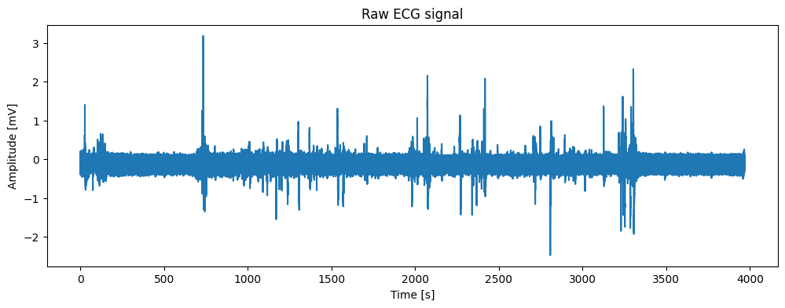
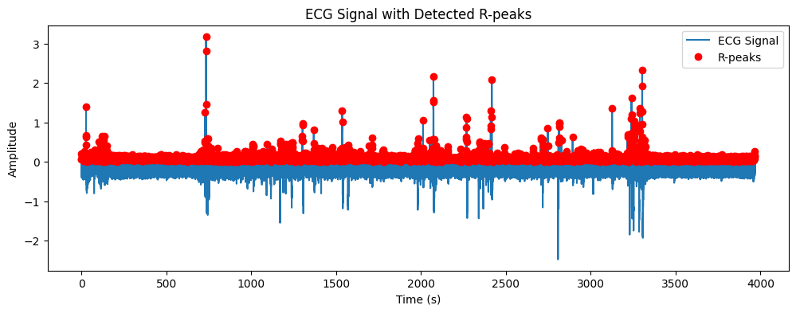
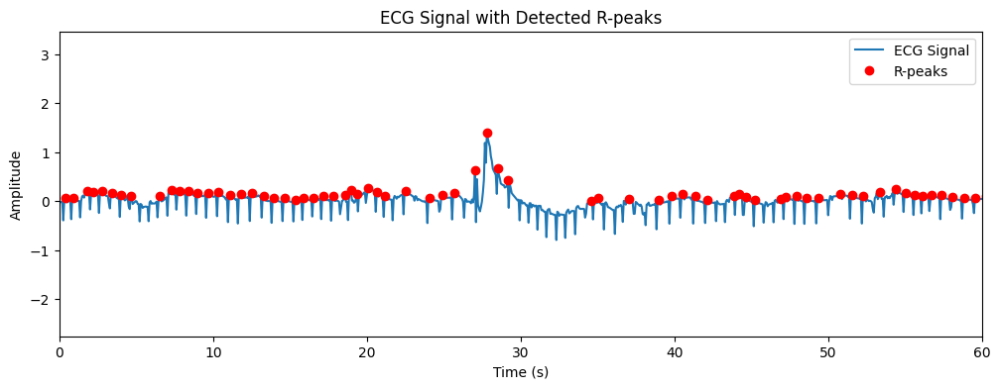
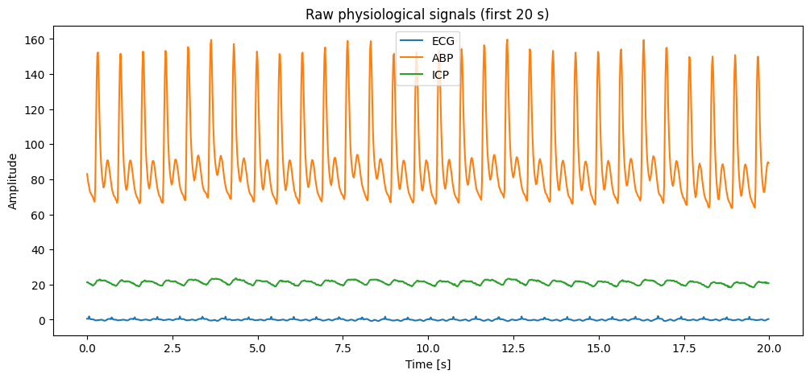
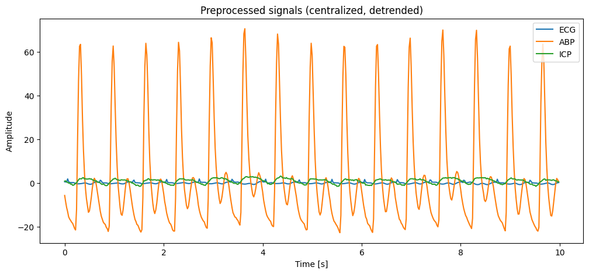
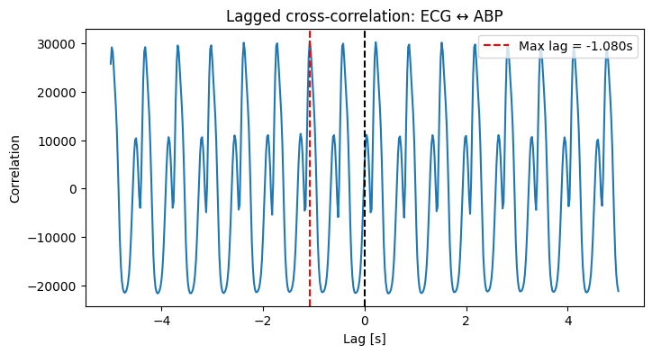
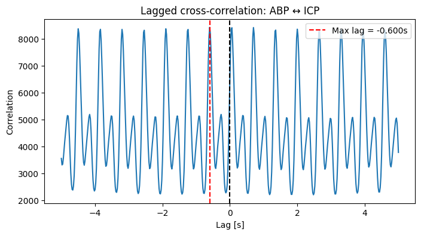
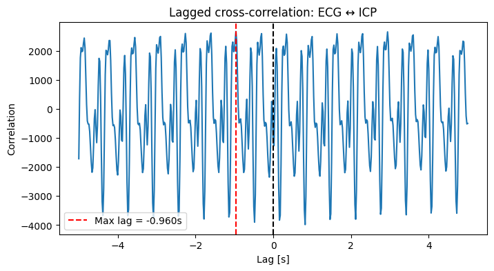
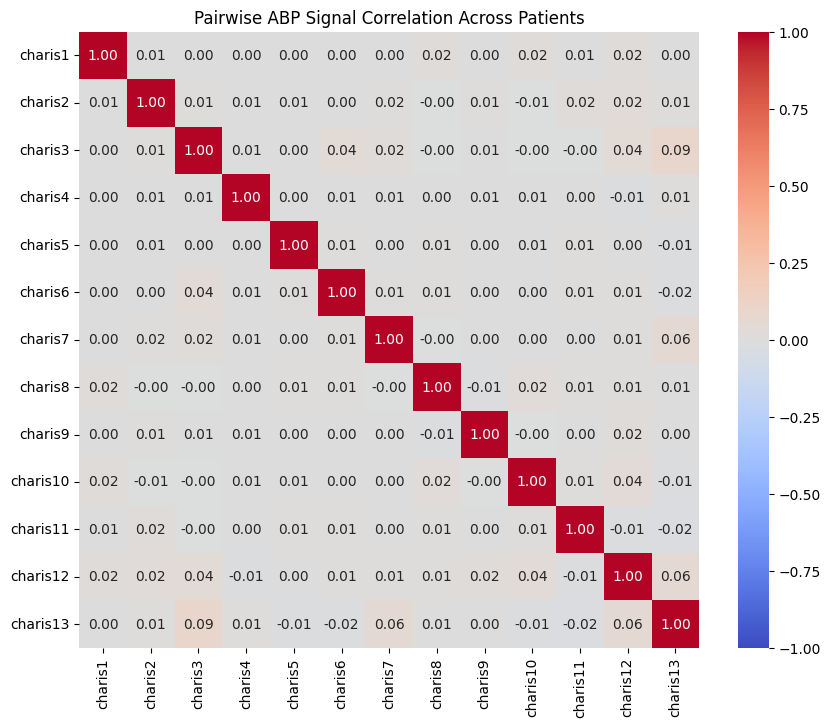

# Research Report: Automated ECG Analysis & Multimodal Hemodynamic Cross-Correlation in Traumatic Brain Injury

**Course:** Advanced Computer Signal Processing (KI/PZS)  
**Institution:** Jan Evangelista Purkyně University in Ústí nad Labem (UJEP)  
**Author:** Aleksandr Demin
**Academic Term:** 2025/2026  
**Repository Module:** `report_1_physiological_signals`

---

## Executive Summary

This investigation tackles two fundamental challenges in computational physiological signal processing:
1. **Automated Heart Rate (HR) Estimation via Electrocardiogram (ECG) R-Peak Detection:** Designing a robust, Z-score normalized peak detection algorithm, applying it to real-world driver monitoring records (PhysioNet `drivedb`), and rigorously validating its detection accuracy against 18 cardiologist-annotated recordings from the MIT-BIH Normal Sinus Rhythm database (`nsrdb`).
2. **Multimodal Hemodynamic Cross-Correlation Analysis in Traumatic Brain Injury (TBI):** Analyzing simultaneous recordings of Arterial Blood Pressure (ABP), Intracranial Pressure (ICP), and ECG from 13 neurocritical patients in the CHARIS database (`charisdb`). We demonstrate why traditional zero-lag Pearson correlation fails ($r \approx 0$) due to physiological pulse transit delays, and establish how normalized lagged cross-correlation uncovers critical hemodynamic latency and cerebral autoregulation disruption ($r$ up to $0.855$ in impaired brain compliance).

---

## Part 1: ECG Heart Rate Estimation and R-Peak Detection

### 1.1 Physiological Background & Objectives
The electrocardiogram (ECG) reflects the electrical depolarization and repolarization vectors of cardiac tissue. The ventricular contraction is triggered by the high-amplitude, high-velocity **QRS complex**, in which the **R-peak** serves as the primary fiducial landmark. 

The time distance between consecutive R-peaks represents the **RR interval** ($RR_i = t_{R, i+1} - t_{R, i}$). Heart rate in beats per minute (BPM) is derived as:

$$\text{HR}_i = \frac{60}{RR_i}$$

The objective is to automatically locate R-peaks in real-world recordings, estimate continuous heart rate, and validate performance on an independent clinical gold-standard benchmark.

---

### 1.2 Mathematical Formulation & Algorithm Design

The custom detector (`detect_r_peaks`) is designed for computational efficiency without relying on third-party black-box toolkits:

1. **Z-Score Normalization:**
   To render peak detection invariant to absolute electrode voltage drift or patient gain differences, the raw ECG waveform $x[n]$ is standardized:
   $$z[n] = \frac{x[n] - \mu_x}{\sigma_x + \epsilon}$$
   where $\mu_x$ is the sample mean, $\sigma_x$ the standard deviation, and $\epsilon = 10^{-12}$ avoids numerical instability.

2. **Adaptive Thresholding and Refractory Window:**
   - **Refractory Period ($\Delta t_{\text{ref}}$):** The physiological refractory period of ventricular depolarization prevents cardiac re-excitation within $\sim 0.30\text{ s}$ ($\le 200\text{ BPM}$). The minimum sample distance between candidate peaks is set to:
     $$d_{\text{min}} = \lfloor \Delta t_{\text{ref}} \cdot f_s \rfloor$$
   - **Threshold Cutoff ($h_{\text{th}}$):** Candidate peaks must exceed a standardized amplitude:
     $$h_{\text{th}} = \mu_z + \alpha \cdot \sigma_z$$
     where $\alpha = 0.0$ allows permissive detection under clean conditions.
   - **Peak Prominence:** A prominence criterion ($\ge 0.5$) ensures low-amplitude baseline noise and high-frequency EMG artifacts are suppressed.

3. **Physiological Filtering & Instantaneous HR:**
   Outlier RR intervals exceeding the biologically feasible window ($[0.30\text{ s}, 2.10\text{ s}]$, corresponding to $[28.5, 200]\text{ BPM}$) are flagged, and average heart rate is computed across valid intervals:
   $$\overline{\text{HR}} = \frac{60}{\frac{1}{M}\sum_{k=1}^M RR_k}$$

---

### 1.3 Application to Real-World Driver Stress Data (`drivedb`)

The algorithm was first applied to record `drive01` of the **Stress Recognition in Automobile Drivers Database** (sampling frequency $f_s = 15.5\text{ Hz}$, duration $T = 3,967.68\text{ s} \approx 66.1\text{ min}$).

#### Figure 1: Raw ECG Waveform

*Figure 1: Full-length raw ECG recording of subject drive01 over 66.1 minutes.*

#### Figure 2: R-Peak Detection Across the Complete Recording

*Figure 2: Overall detection of 5,047 R-peaks with instantaneous heart rate estimation.*

#### Figure 3: High-Resolution 60-Second Zoom

*Figure 3: Magnified 60-second window illustrating precise fiducial R-peak localization.*

**Results on `drive01`:**
- Total R-peaks detected: **5,047**
- Mean Heart Rate: **87.26 BPM**
- Observation: Peak picking performs well during steady segments; however, baseline wanders and sudden automotive motion artifacts induce local amplitude drops, highlighting the necessity of clinical benchmark validation.

---

### 1.4 Clinical Benchmark: MIT-BIH Normal Sinus Rhythm Database (`nsrdb`)

To quantitatively evaluate precision against physician reference annotations, the algorithm was tested across all 18 full-length Holter recordings from the **MIT-BIH Normal Sinus Rhythm Database** ($f_s = 128\text{ Hz}$).

The detection accuracy was computed as:
$$\text{Accuracy (\%)} = \max\left(0,\, 100 \cdot \left(1 - \frac{|\text{HR}_{\text{actual}} - \text{HR}_{\text{detected}}|}{\text{HR}_{\text{actual}}}\right)\right)$$

| Patient Record | Actual HR (BPM) | Detected HR (BPM) | Accuracy (%) |
|:--------------:|:---------------:|:-----------------:|:------------:|
| **16265** | 66.09 | 76.96 | 83.55% |
| **16272** | 64.76 | 78.55 | 78.71% |
| **16273** | 60.94 | 76.00 | 75.29% |
| **16420** | 71.19 | 73.65 | 96.54% |
| **16483** | 67.14 | 67.66 | **99.23%** |
| **16539** | 73.68 | 90.86 | 76.68% |
| **16773** | 78.49 | 60.98 | 77.70% |
| **16786** | 69.24 | 77.70 | 87.78% |
| **16795** | 61.97 | 76.18 | 77.06% |
| **17052** | 63.40 | 68.54 | 91.90% |
| **17453** | 69.16 | 74.20 | 92.71% |
| **18177** | 75.13 | 94.59 | 74.10% |
| **18184** | 72.06 | 75.57 | 95.13% |
| **19088** | 82.55 | 70.49 | 85.39% |
| **19090** | 56.48 | 57.90 | 97.49% |
| **19093** | 60.02 | 54.22 | 90.33% |
| **19140** | 66.87 | 67.26 | **99.42%** |
| **19830** | 79.85 | 102.05 | 72.20% |
| **Overall Mean** | — | — | **86.00%** |

#### Diagnostic Discussion & Limitations
1. **High-Accuracy Group ($\ge 95\%$):** Records like `16483` (99.23%), `19140` (99.42%), and `19090` (97.49%) display stable isoelectric baselines and sharp, monophasic R-peaks where Z-score prominence easily discriminates QRS complexes from T-waves.
2. **Reduced-Accuracy Group ($72\% - 78\%$):** Records such as `19830` (72.20%) and `18177` (74.10%) suffer from:
   - **T-Wave Over-detection:** Tall, peaked T-waves exceeding the prominence threshold during bradycardic phases.
   - **Respiration Baseline Drift:** Slow modulation of baseline amplitude causing true R-peaks to fall below the global mean threshold.
   - **Conclusion:** While suitable for clean consumer-grade signals, clinical usage mandates bandpass filtering (0.5–40 Hz), derivative-squared transforms (Pan-Tompkins stage), or adaptive dual-threshold state machines.

---

## Part 2: Multimodal Hemodynamic Correlation in Traumatic Brain Injury

### 2.1 Clinical Problem: Intracranial Dynamics and Autoregulation
In neurocritical intensive care, monitoring patients with severe Traumatic Brain Injury (TBI) relies on understanding the relationship between systemic hemodynamics and intracranial status:
- **Arterial Blood Pressure (ABP):** Systemic perfusion pressure driving cerebral blood flow.
- **Intracranial Pressure (ICP):** Pressure exerted by brain parenchyma, CSF, and cerebral blood volume within the rigid cranium (Monro-Kellie doctrine).
- **Cerebral Autoregulation:** In a healthy brain, cerebral vessels constrict or dilate to maintain constant blood flow despite ABP variations. When autoregulation is impaired by TBI, fluctuations in ABP translate directly and synchronously into intracranial pressure surges, creating a high correlation that portends intracranial hypertension and secondary ischemic injury.

---

### 2.2 Signal Preprocessing Pipeline

Data from the **CHARIS Database** (`charisdb`) contains simultaneous ABP, ICP, and ECG recordings across 13 patients ($f_s = 50\text{ Hz}$). Each recording underwent a standardized preprocessing workflow:
1. **Observation Windowing:** Selection of the initial 1-hour recording epoch ($T = 3,600\text{ s}$, $N = 180,000\text{ samples}$).
2. **Missing Data Imputation:** NaN gaps caused by transducer flushing or movement artifacts were recovered via 1D linear interpolation:
   $$x_{\text{clean}}[n] = \text{interp1d}(x_{\text{observed}}[n])$$
3. **Detrending & Centralization:** Removing non-physiological baseline drifts and shifting to zero mean:
   $$x_{\text{detrend}}[n] = x[n] - \hat{p}(n), \quad \tilde{x}[n] = x_{\text{detrend}}[n] - \overline{x_{\text{detrend}}}$$

#### Figure 4: Raw Multimodal Physiological Signals (Patient `charis6`)

*Figure 4: First 20 seconds of raw ABP, ECG, and ICP waveforms demonstrating baseline elevation and amplitude disparities.*

#### Figure 5: Preprocessed, Centralized Signals

*Figure 5: Normalized, zero-mean physiological signals ready for correlation analysis.*

---

### 2.3 Instantaneous Pearson Correlation vs. Lagged Cross-Correlation

Applying standard zero-lag Pearson correlation to `charis6` yields misleading results:

| Signal Pair | Pearson Correlation ($r$) | $p$-value |
|:-----------:|:-------------------------:|:---------:|
| **ECG – ABP** | $0.0267$ | $< 10^{-5}$ |
| **ECG – ICP** | $-0.0065$ | $0.0058$ |
| **ABP – ICP** | $0.0366$ | $< 10^{-5}$ |

**Why Pearson correlation indicates near-zero dependence:**  
Physiological processes do not propagate instantaneously:
- Cardiac ventricular ejection (ECG R-wave) requires hundreds of milliseconds to travel down the arterial tree to the pressure catheter (**Pulse Wave Transit Time, PWTT**).
- Pressure transmission from carotid arteries into the intracranial vault experiences viscoelastic compliance delays.

To capture delayed coupling, we compute the **Normalized Lagged Cross-Correlation**:

$$R_{xy}(\tau) = \frac{1}{N \sigma_x \sigma_y} \sum_{t} x(t) \cdot y(t + \tau)$$

evaluated across a physiological lag window $\tau \in [-5.0\text{ s}, +5.0\text{ s}]$.

#### Figure 6: Cross-Correlation: ECG $\leftrightarrow$ ABP

*Figure 6: Cross-correlation between ECG and ABP revealing a dominant peak of $r = 0.169$ at lag $\tau = -1.080\text{ s}$.*

#### Figure 7: Cross-Correlation: ABP $\leftrightarrow$ ICP

*Figure 7: Cross-correlation between ABP and ICP for patient charis6.*

#### Figure 8: Cross-Correlation: ECG $\leftrightarrow$ ICP

*Figure 8: Cross-correlation between ECG and ICP showing subtle cardiac pulsatile transmission into intracranial space.*

---

### 2.4 Comprehensive Cohort Analysis Across All 13 Patients

Cross-correlation was evaluated across the entire CHARIS cohort:

| Patient | ECG–ABP Max Lag (s) | ECG–ABP Max $r$ | ABP–ICP Max Lag (s) | ABP–ICP Max $r$ | ECG–ICP Max Lag (s) | ECG–ICP Max $r$ |
|:-------:|:-------------------:|:---------------:|:-------------------:|:---------------:|:-------------------:|:---------------:|
| **charis1**  | $0.00$ | $0.0305$ | $-3.32$ | $-0.0020$ | $+0.10$ | $0.1410$ |
| **charis2**  | $+0.28$ | $0.3893$ | $-0.02$ | $0.5771$ | $+0.24$ | $0.1658$ |
| **charis3**  | $+0.92$ | $0.1717$ | $0.00$  | **$0.8547$** | $-0.42$ | $0.0651$ |
| **charis4**  | $0.00$ | $0.0238$ | $+0.62$ | $0.0276$ | $-0.60$ | $0.1577$ |
| **charis5**  | $0.00$ | $0.0230$ | $-0.86$ | $0.0095$ | $-0.62$ | $0.0527$ |
| **charis6**  | $+0.26$ | **$0.5664$** | $+0.02$ | $0.5675$ | $+1.08$ | **$0.3945$** |
| **charis7**  | $+0.30$ | $0.3266$ | $-0.02$ | $0.6400$ | $+0.32$ | $0.2043$ |
| **charis8**  | $+0.26$ | $0.2554$ | $-0.04$ | $0.4311$ | $+0.20$ | $0.1392$ |
| **charis9**  | $+0.58$ | $0.1476$ | $+0.06$ | $0.4676$ | $+1.16$ | $0.0867$ |
| **charis10** | $+0.02$ | $0.3050$ | $+0.08$ | **$0.7298$** | $+0.28$ | $0.3425$ |
| **charis11** | $+0.06$ | $0.3988$ | $-0.02$ | **$0.7190$** | $+0.02$ | $0.3339$ |
| **charis12** | $+0.34$ | $0.0892$ | $-4.98$ | $0.1056$ | $0.00$ | $0.0171$ |
| **charis13** | $-1.08$ | $0.1691$ | $-0.60$ | $0.0468$ | $-0.96$ | $0.0148$ |

#### Pathophysiological Findings
1. **Severe Autoregulatory Impairment:** Patients `charis3` ($r = 0.855$), `charis10` ($r = 0.730$), and `charis11` ($r = 0.719$) exhibit intense cross-correlation with near-zero latency ($\tau \approx -0.02\text{ s}$ to $+0.08\text{ s}$). In these subjects, intracranial compliance is exhausted; arterial pressure pulses pass unfiltered into the cranial vault.
2. **Preserved Compliance / Low Coupling:** Patients `charis1`, `charis4`, `charis5`, and `charis13` show negligible correlation ($r < 0.05$), indicating intact cerebral autoregulation dampening systemic pressure transients, or sensor displacement.

---

### 2.5 Inter-Patient ABP Signal Correlation

To investigate whether systemic pressure dynamics are synchronous or cross-correlated between different patients, pairwise lagged cross-correlation was computed across all pairs of the 13 patients on the ABP channel.

#### Figure 9: Cross-Patient ABP Correlation Heatmap

*Figure 9: Cross-correlation matrix between all 13 patient ABP signals.*

**Conclusion:** Off-diagonal values are uniformly minimal ($r \approx 0.00$ to $0.08$). Arterial waveforms are driven by independent autonomic pacemakers; without external global entrainment, no cross-patient waveform alignment exists.

---

## Part 3: Reproducibility & Code Execution

All algorithms are implemented in modular Python scripts located in the `src/` directory.

### Quick Execution
```bash
# Run standalone pipeline in synthetic demo mode (no data download required)
python report_1_physiological_signals/src/run_ecg_pipeline.py --demo

# Run against local PhysioNet datasets
python report_1_physiological_signals/src/run_ecg_pipeline.py --data-dir path/to/data
```

---

## References

1. **PhysioNet:** Goldberger, A. L., et al. "PhysioBank, PhysioToolkit, and PhysioNet: Components of a new research resource for complex physiologic signals." *Circulation* 101.23 (2000): e215-e220.
2. **Stress Recognition Database:** Healey, J. A., & Picard, R. W. "Detecting stress during real-world driving tasks using physiological sensors." *IEEE Transactions on Intelligent Transportation Systems* 6.2 (2005): 156-166.
3. **MIT-BIH Normal Sinus Rhythm Database:** Mark, R., & Moody, G. PhysioNet Database `nsrdb/1.0.0`.
4. **CHARIS Database:** Kim, S., et al. "The CHARIS GUI: Continuous Hemodynamic and Autoregulation Information System." *Physiological Measurement* 37.8 (2016): 1342.
5. **Pan-Tompkins Algorithm:** Pan, J., & Tompkins, W. J. "A real-time QRS detection algorithm." *IEEE Transactions on Biomedical Engineering* 32.3 (1985): 230-236.
