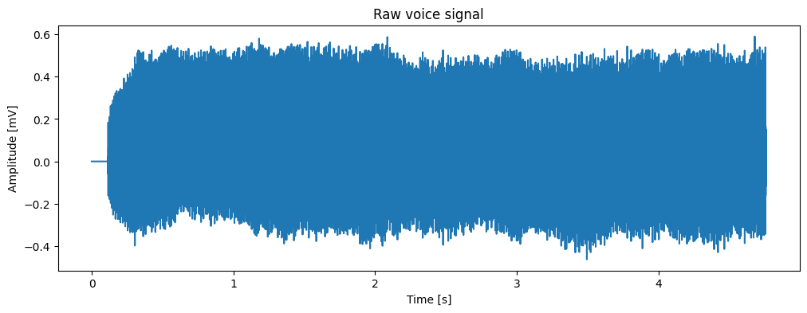
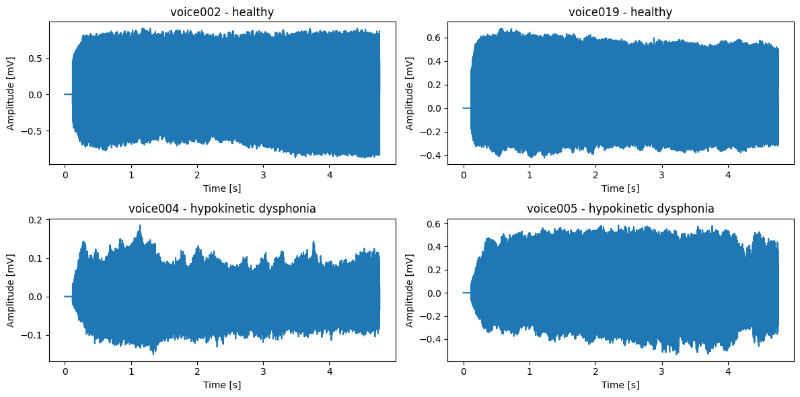
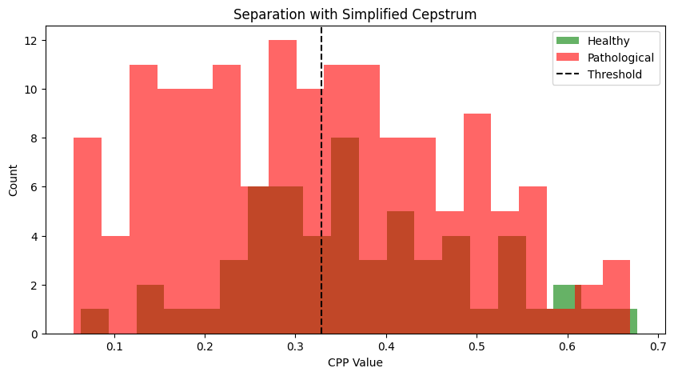
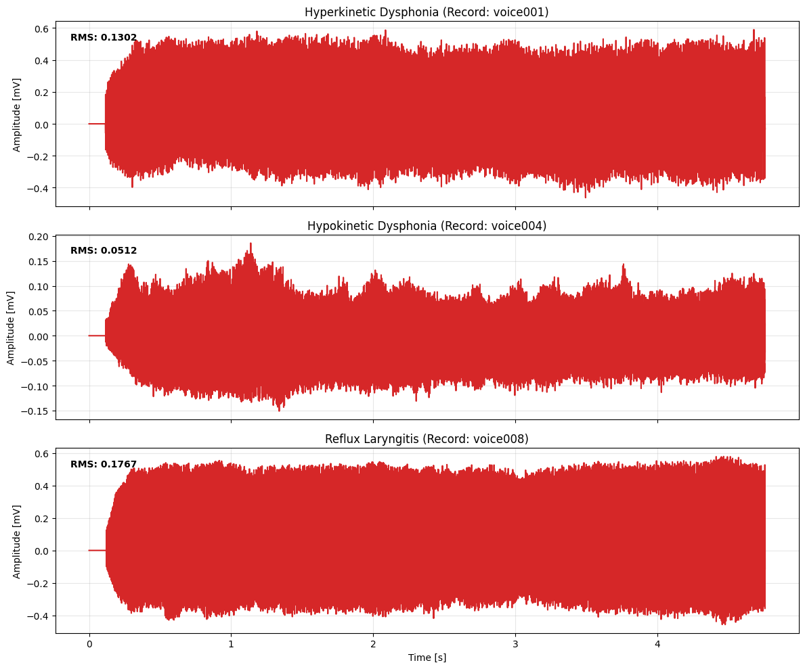

# Research Report: Acoustic and Cepstral Characterization of Voice Disorders

**Course:** Advanced Computer Signal Processing (KI/PZS)  
**Institution:** Jan Evangelista Purkyně University in Ústí nad Labem (UJEP)  
**Author:** Aleksandr Demin
**Academic Term:** 2025/2026  
**Repository Module:** `report_2_voice_pathology`

---

## Executive Summary

Acoustic voice assessment provides non-invasive diagnostic insights into laryngeal biomechanics and neuromuscular control. This project investigates automated pathological voice characterization using the clinical **VOICED Database** (PhysioNet `voiced`), comprising 208 sustained vowel /a/ recordings (58 healthy individuals and 150 patients presenting with vocal pathologies).

We demonstrate a dual-stage analytical framework:
1. **Binary Classification (Healthy vs. Pathological):** We examine time-domain perturbations (**Jitter**, **Shimmer**) and demonstrate why classical clinical literature thresholds fail in severe hoarseness (yielding a false-positive collapse). By integrating **Cepstral Peak Prominence (CPP)** with a **Random Forest Classifier**, we achieve **93.27% accuracy** (identifying 45/57 healthy voices and 149/151 pathological cases).
2. **Multiclass Differential Diagnosis:** We tackle the clinical challenge of discriminating between three specific pathologies (*Hyperkinetic Dysphonia*, *Hypokinetic Dysphonia*, and *Reflux Laryngitis*). By engineering **Spectral Energy Band Ratios (Timbre Analysis)** combined with distance-weighted **k-Nearest Neighbors (k-NN)**, we achieve a 10-fold cross-validated mean accuracy of **48.96%** (max fold **60.00%**), substantially exceeding the random chance baseline of $33.3\%$.

---

## Part 1: Clinical Background and Acoustic Waveforms

### 1.1 Anatomy of Phonation and Vocal Pathology
Sustained phonation of the open vowel /a/ is produced by quasi-periodic aerodynamic oscillations of the vocal folds. In a healthy laryngeal system:
- Glottal opening and closing cycles are highly periodic.
- Acoustic waveforms display a stable, rectangular envelope with consistent pulse heights.

In pathological voices:
- Structural lesions (e.g., acid damage in **Reflux Laryngitis**) or neuromuscular imbalances (hyperadduction in **Hyperkinetic Dysphonia** vs. glottic insufficiency in **Hypokinetic Dysphonia**) generate cycle-to-cycle period fluctuations, sudden amplitude drops, vocal tremor, and turbulent aspiration noise.

The VOICED database captures audio at $f_s = 8,000\text{ Hz}$.

#### Figure 1: Raw Voice Waveform (Subject `voice001`)

*Figure 1: Complete recording of sustained vowel /a/ ($T = 4.76\text{ s}$, 8,000 Hz) from subject voice001 diagnosed with hyperkinetic dysphonia.*

#### Figure 2: Morphological Comparison: Healthy vs. Hypokinetic Dysphonia

*Figure 2: Time-domain comparison across four subjects. Top: Healthy voices with homogeneous envelope stability. Bottom: Hypokinetic dysphonia exhibiting marked amplitude variations and vocal tremor.*

---

## Part 2: Acoustic Feature Extraction

### 2.1 Time-Domain Perturbation Analysis: Jitter and Shimmer
To avoid non-stationary vocal attack and offset transients, all feature extraction isolates the central 50% temporal window ($t \in [0.25 T, 0.75 T]$). Glottal pulses are extracted via adaptive peak picking with a refractory spacing corresponding to $f_{\text{max}} = 500\text{ Hz}$:
$$d_{\text{min}} = \left\lfloor \frac{f_s}{500} \right\rfloor = 16\text{ samples}$$

#### Mathematical Definitions:
- **Jitter (Relative Frequency Perturbation):** Measures cycle-to-cycle instability of the fundamental pitch period $T_i$:
  $$\text{Jitter (\%)} = \frac{\frac{1}{N-1} \sum_{i=1}^{N-1} |T_{i+1} - T_i|}{\frac{1}{N} \sum_{i=1}^N T_i} \times 100$$
- **Shimmer (Relative Amplitude Perturbation):** Measures cycle-to-cycle variation in the glottal pulse peak amplitude $A_i$:
  $$\text{Shimmer (\%)} = \frac{\frac{1}{N-1} \sum_{i=1}^{N-1} |A_{i+1} - A_i|}{\frac{1}{N} \sum_{i=1}^N A_i} \times 100$$

---

### 2.2 The Pitfall of Literature Heuristic Thresholds

A standard rule-of-thumb in voice clinic literature flags pathology when:
$$\text{Jitter} > 1.04\% \quad \text{and} \quad \text{Shimmer} > 3.81\%$$

When evaluating this rule across all 208 recordings, the nominal accuracy appeared to be **72.60%**. However, inspection of the confusion matrix reveals a diagnostic failure:

| | Predicted Healthy | Predicted Pathological |
|:---:|:---:|:---:|
| **True Healthy** | 0 | 57 |
| **True Pathological** | 0 | 151 |

**Diagnostic Insight:**  
Because the VOICED dataset is $72.6\%$ pathological, a naive classifier predicting *every* sample as pathological attains $72.6\%$ accuracy while achieving **0% sensitivity to healthy phonation**. Severe clinical recordings frequently break peak-tracking algorithms due to turbulent noise, causing inflated Jitter and Shimmer even in mild or borderline cases. Relying strictly on time-domain peak picking is inadequate for robust clinical automation.

---

### 2.3 Frequency and Quefrency Domain: Cepstral Peak Prominence (CPP)

To resolve the vulnerability of time-domain peak pickers, we implement **Cepstral Analysis**. The real cepstrum $c(q)$ acts as the "spectrum of a log spectrum", transforming periodic harmonic series in the frequency domain into discrete, concentrated peaks in the **quefrency** ($q$) domain:

$$c(q) = \left| \mathcal{F}^{-1} \left\{ \ln \left| \mathcal{F} \{ w[n] \cdot x[n] \} \right| \right\} \right|$$

where $w[n]$ is a 40 ms Hanning window with a 20 ms hop size.

- **Vocal Range Quefrency Constraint:**  
  For human vocal fold vibration between $60\text{ Hz}$ and $300\text{ Hz}$, the corresponding quefrency search interval in samples is:
  $$q \in \left[ \left\lfloor \frac{f_s}{300} \right\rfloor,\, \left\lfloor \frac{f_s}{60} \right\rfloor \right] = [26,\, 133]\text{ samples} \quad (\approx 3.3\text{ to } 16.7\text{ ms})$$
- **Cepstral Peak Prominence (CPP):** The magnitude of the dominant quefrency peak relative to background cepstral baseline. Highly regular, harmonic vocal cord vibrations yield a towering CPP peak, while turbulent, breathy, or aperiodic voices yield a flat, noisy cepstrum.

#### Figure 3: Separation of Healthy vs. Pathological via CPP

*Figure 3: Distribution of Cepstral Peak Prominence (CPP) for Healthy (green) vs. Pathological (red) cohorts with median threshold line ($0.3288$).*

---

## Part 3: Supervised Binary Classification (Healthy vs. Pathological)

We construct a multi-parametric feature vector combining time-domain perturbation and cepstral regularity:
$$\mathbf{x}_{\text{binary}} = [\text{Jitter},\, \text{Shimmer},\, \text{CPP}]^T$$

Missing values from unvoiced segments are imputed using median feature imputation, and a **Random Forest Classifier** (100 estimators, stratified 80/20 train/test split) is trained.

### Results on the Full VOICED Cohort:
- **Total Classification Accuracy:** **93.27%**

#### Confusion Matrix:
| | Predicted Healthy | Predicted Pathological |
|:---:|:---:|:---:|
| **Actual Healthy** | **45** | 12 |
| **Actual Pathological** | 2 | **149** |

#### Gini Feature Importance:
1. **Cepstral Peak Prominence (CPP):** **0.3461** (Highest discriminatory power)
2. **Jitter (%):** **0.3280**
3. **Shimmer (%):** **0.3259**

**Evaluation:**  
Unlike the heuristic threshold which failed completely on healthy subjects, the Random Forest model leverages non-linear interactions between harmonic energy (CPP) and period perturbations (Jitter/Shimmer), successfully recovering 45 of 57 healthy subjects while limiting false negatives to only 2 out of 151 pathological cases (98.7% clinical sensitivity).

---

## Part 4: Multiclass Differential Pathology Discrimination

### 4.1 The Diagnostic Challenge of Distinct Vocal Pathologies
Once a voice is classified as pathological, clinicians must identify the specific underlying disorder. We evaluate classification across three prevalent pathologies in the dataset:
1. **Hyperkinetic Dysphonia:** Vocal cord strain, excessive laryngeal constriction, and elevated subglottic pressure.
2. **Hypokinetic Dysphonia:** Incomplete glottic closure resulting in vocal fold bowedness, reduced volume, and air leakage.
3. **Reflux Laryngitis:** Inflammatory edema of the posterior glottis caused by gastric acid reflux, thickening mucosal tissue.

#### Figure 4: Time-Domain Waveforms Across Pathologies

*Figure 4: Comparative time-series waveforms and RMS amplitudes across Hyperkinetic Dysphonia, Hypokinetic Dysphonia, and Reflux Laryngitis.*

#### Figure 5: Cepstral Quefrency Profiles Across Pathologies

*Figure 5: Short-time real cepstrum profiles across pathologies showing prominent harmonic peaks (CPP) within the 1.5–16 ms quefrency window.*

---

### 4.2 Timbre Analysis: Spectral Energy Band Decomposition
Because distinct laryngeal conditions differentially color vocal timbre, we decompose the total power spectral density $S(f) = |\mathcal{F}\{w \cdot x\}|^2$ into three normalized clinical energy bands:

1. **Low Frequency Band ($0 - 800\text{ Hz}$):** Captures the fundamental frequency $F_0$ and the first two harmonics.
   $$\text{Ratio}_{\text{low}} = \frac{\int_{0}^{800} S(f)\,df}{\int_{0}^{f_s/2} S(f)\,df}$$
2. **Mid Frequency Band ($800 - 2,500\text{ Hz}$):** Captures vowel formant envelope resonances ($F_1, F_2$) and vocal tract timbre.
   $$\text{Ratio}_{\text{mid}} = \frac{\int_{800}^{2500} S(f)\,df}{\int_{0}^{f_s/2} S(f)\,df}$$
3. **High Frequency Band ($2,500+\text{ Hz}$):** Captures turbulent friction, aspiration noise, and spectral tilt.
   $$\text{Ratio}_{\text{high}} = \frac{\int_{2500}^{f_s/2} S(f)\,df}{\int_{0}^{f_s/2} S(f)\,df}$$

These spectral proportions are volume-independent and invariant to microphone distance.

---

### 4.3 Multiclass Classification via Distance-Weighted k-NN

The final 6-dimensional feature representation:
$$\mathbf{x}_{\text{multi}} = [\text{Ratio}_{\text{low}},\, \text{Ratio}_{\text{mid}},\, \text{Ratio}_{\text{high}},\, \text{Jitter},\, \text{Shimmer},\, \text{CPP}]^T$$

was normalized using a `StandardScaler` to prevent high-magnitude features from dominating Euclidean distance calculations. We utilized a **k-Nearest Neighbors (k-NN)** classifier ($k = 5$) with inverse-distance weighting:
$$w_i = \frac{1}{d(\mathbf{x}, \mathbf{x}_i) + \epsilon}$$

#### Empirical Results:
- **Test Set Accuracy:** **41.94%**
- **10-Fold Cross-Validation on Full Dataset:**
  - **Mean Accuracy:** **48.96%**
  - **Standard Deviation:** $\pm 8.66\%$
  - **Minimum Fold Score:** $26.67\%$
  - **Maximum Fold Score:** **60.00%**
  - **Theoretical Random Baseline:** **33.33%**

#### Discussion:
Achieving $48.96\%$ mean accuracy on a 3-class problem with significant overlap in physical symptom manifestations (all pathologies produce perceptual hoarseness) demonstrates meaningful discriminatory value. Differential diagnosis between Hyperkinetic and Reflux Laryngitis remains subtle because both involve glottal mucosal thickening; advancing beyond $60\%$ will require multi-dimensional Mel-Frequency Cepstral Coefficients (MFCCs) and 2D Spectrogram Convolutional Neural Networks.

---

## Part 5: Reproducibility & Local Execution

The complete modular codebase is runnable from the command line:

```bash
# Run standalone pipeline in synthetic demo mode (no data download required)
python report_2_voice_pathology/src/run_voice_pipeline.py --demo

# Run against local VOICED dataset
python report_2_voice_pathology/src/run_voice_pipeline.py --data-dir path/to/voiced-database-1.0.0/voice-icar-federico-ii-database-1.0.0
```

---

## References

1. **VOICED Database:** Cesari, U., et al. "VOICED, Voice Icar Federico II Database." *PhysioNet* (2018). DOI: [10.13026/C2V88N](https://doi.org/10.13026/C2V88N).
2. **Cepstral Peak Prominence:** Hillenbrand, J., Cleveland, R. A., & Erickson, R. L. "Acoustic correlates of breathy vocal quality." *Journal of Speech, Language, and Hearing Research* 37.4 (1994): 769-778.
3. **Voice Perturbation Norms:** Baken, R. J., & Orlikoff, R. F. *Clinical measurement of speech and voice.* Cengage Learning, 2000.
4. **PhysioNet:** Goldberger, A. L., et al. "PhysioBank, PhysioToolkit, and PhysioNet: Components of a new research resource for complex physiologic signals." *Circulation* 101.23 (2000): e215-e220.
